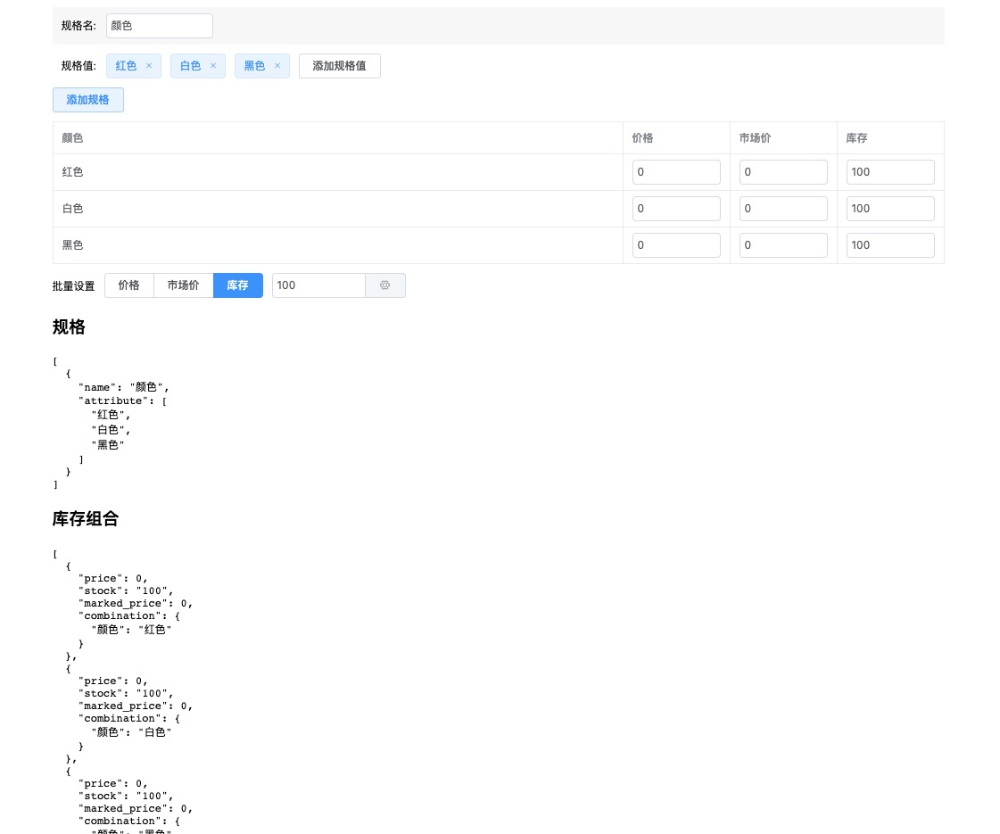

## vue element-ui 商品sku编辑组件demo

[Demo Page](https://easeava.github.io/vue-sku/)

```
import Specification from '@/components/specification'

components: {
  Specification
}
```

```
data () {
  return {
    spec: [
      {
        name: '颜色',
        attribute: [
          '红色', '白色', '黑色'
        ]
      }
    ],
    sku: [
      {
        price: 0,
        stock: 0,
        marked_price: 0,
        combination: {
          '颜色': '红色'
        }
      },
      {
        price: 0,
        stock: 0,
        marked_price: 0,
        combination: {
          '颜色': '白色'
        }
      },
      {
        price: 0,
        stock: 0,
        marked_price: 0,
        combination: {
          '颜色': '黑色'
        }
      }
    ]
  }
}

methods: {
  handleChangeSpec (spec) {
    this.spec = spec
  },

  handleChangeSku (sku) {
    this.sku = sku
  }
}

<speciication :spec="spec" :sku="sku" @change-spec="handleChangeSpec" @change-sku="handleChangeSku" />
```


